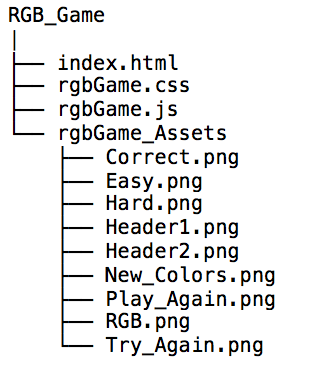

# Juan's Amazing Color Game!

### Introduction

The purpose of this simple website is to provide a simple web game where the user can estimate or guess 
the RGB color listed, and pick a color! A modal with information is included on the site.

### Link:

Click the following link to visit the game's site: https://juan-moctezuma.github.io/AmazingColorGame/ 

### Does the code require a local web server to run?
No.

### Directory Tree

### Technologies

1. HTML5
2. CSS3:
   * Responsive Framework: Bootstrap 3
3. JavaScript:
   * Ajax
